IrenSystem - это проект который впитал в себя весь опыт что требуется фрилансеру для организации своего бизнеса
в интернете.

Основная вся фишка в том , что если вы один человек вы сможете вести всех своих клиентов в едином пространстве.
Помимо обычной функции таск-менеджера, система также выполняет роль портфолио. То есть после завершения проекта
вы можете выложить свое портфолио. И сайт будет выглядеть как обычный корпоративный сайт.
Также имеется возможность выставлять счета и прочее.

Для тех кому лень листать,вот презентация

https://docs.google.com/presentation/d/1o11YO5-M3hni_reA38VPWa95-E5ByWmQVfnjpW93GiE/edit?usp=sharing

Текущая версия v1.3

**Корпоративный веб-сайт**

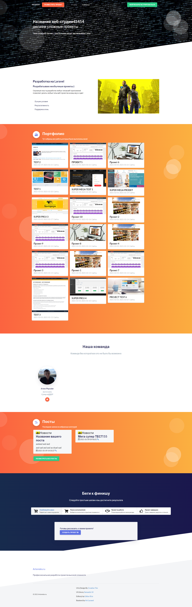

Главная страница содержит список услуг, которые будет оказывать ваша компания.
Список работ которые сделали ваши работники. Список людей которые состоят в вашей команде.
А также последние новости из вашего блога.

Каждый исполнитель имеет свой профиль со своими отзывами и своим портфолио

У каждого исполнителя есть доступ для управления своим портфолио 

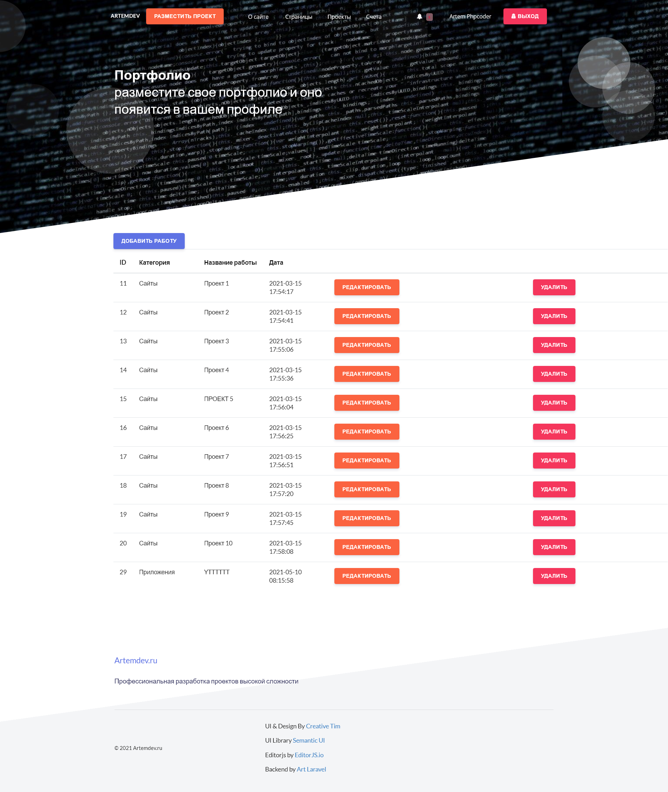

**Проектная система**

Когда клиент размещает свой проект в системе. Этот проект становится доступным 
исполнителям у которых есть доступ к категории проекта. Проект показывается в общем списке со статусом поиск исполнителя

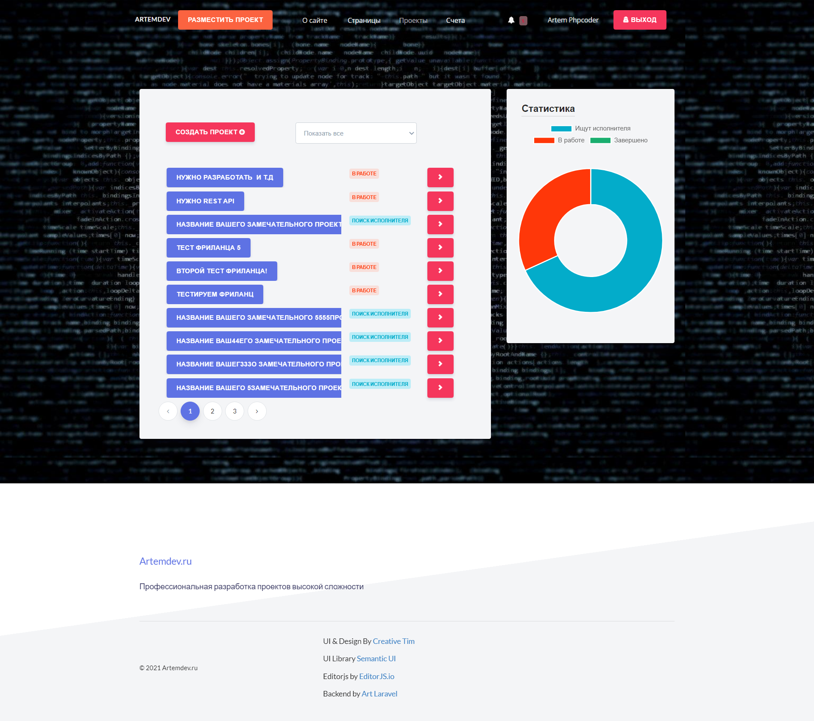

Вот так выглядит проект со статусом поиск исполнителя

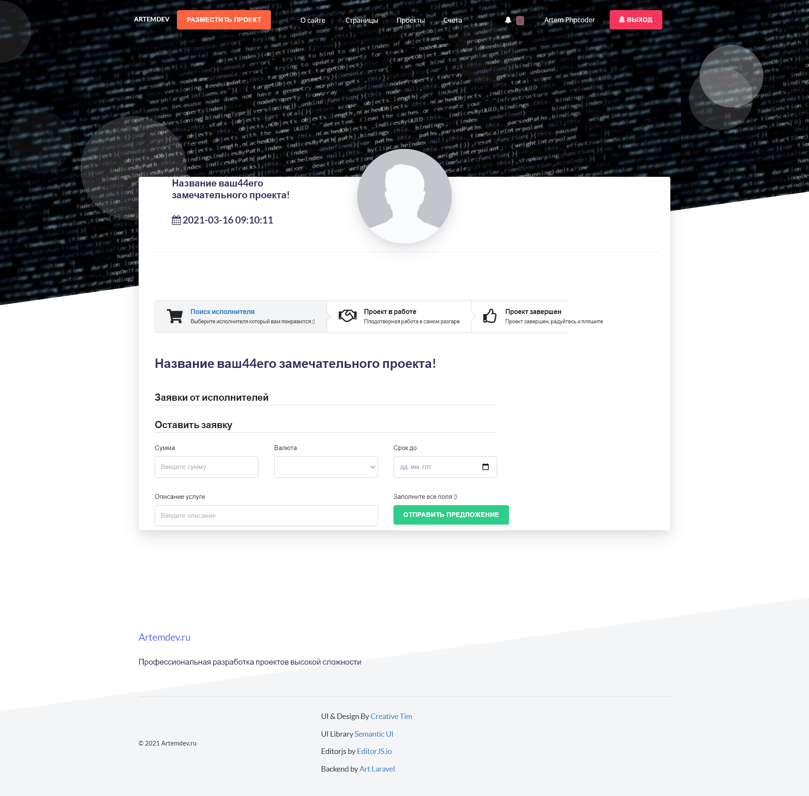

Если клиент утвердит ваши условия,то проект переходит в работу

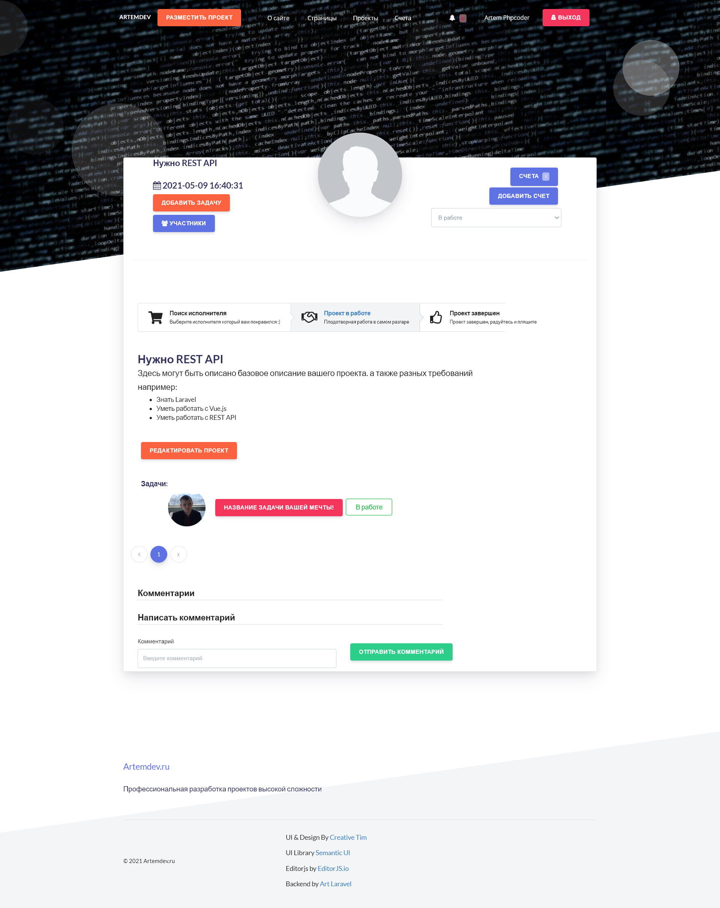

В случае если проекту требуются новые доработки, которые не были учтены в начальном ТЗ.
Исполнитель может добавить новый счет

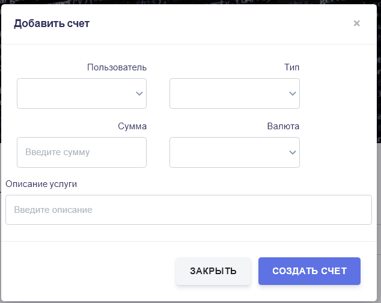

Если клиент потдверждает обязательства по счету, а после подтверждает что все выполнено.
Счет переносится в раздел счета

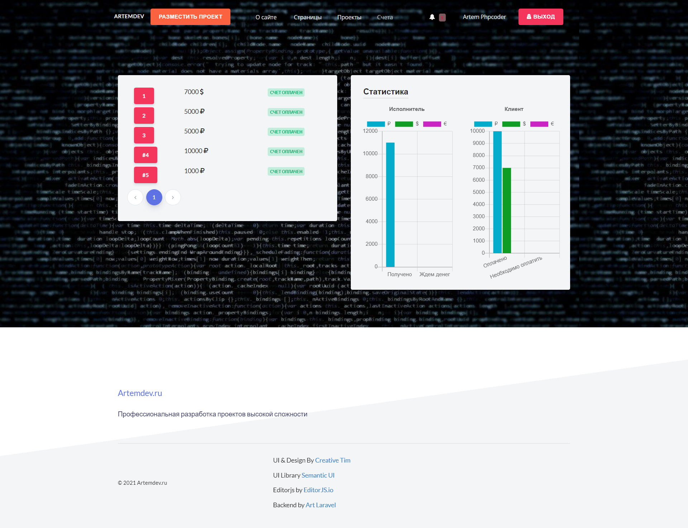

Для указания своих реквизитов у исполнителя есть раздел с настройками реквизитов

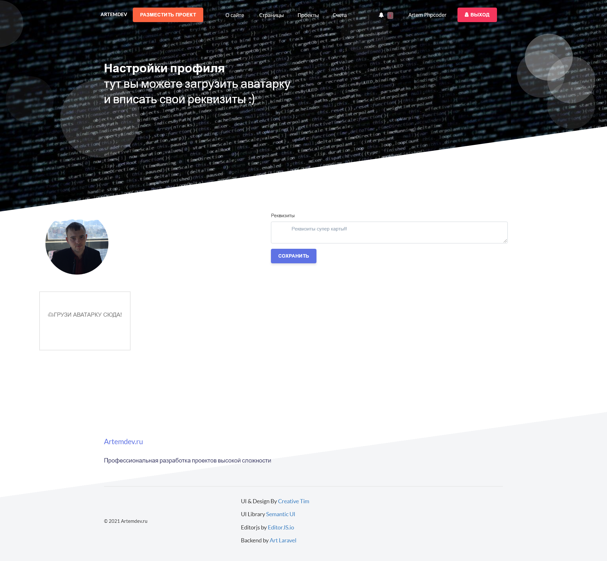

**Админка**

Главная страница админки

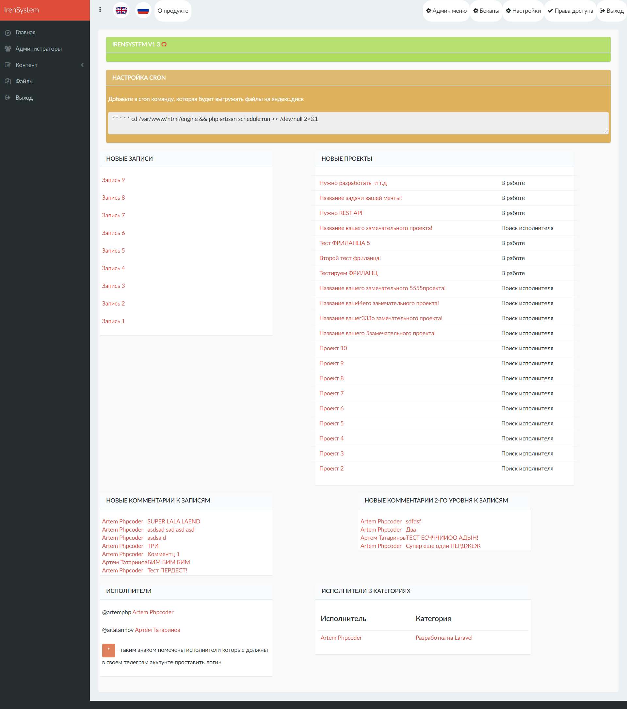

Редактирование работы из портфолио

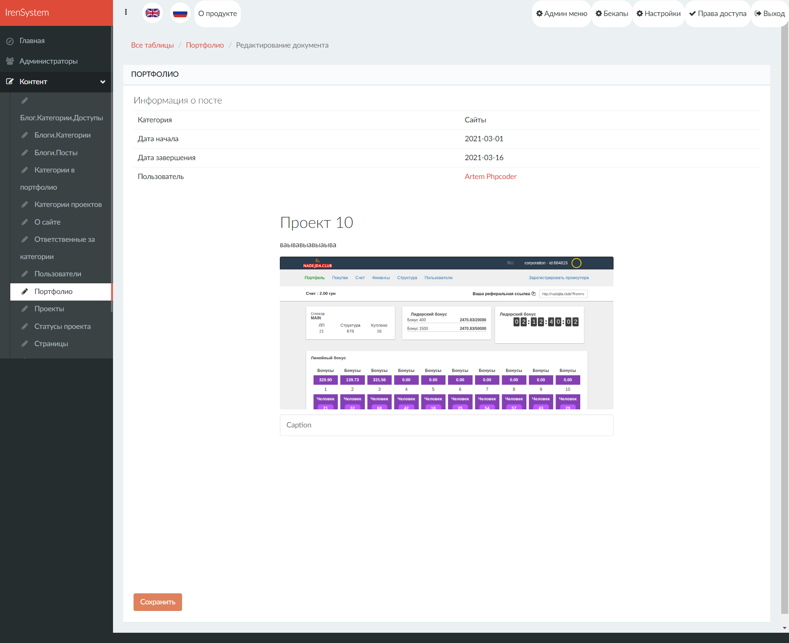

Редактирование проекта из админки

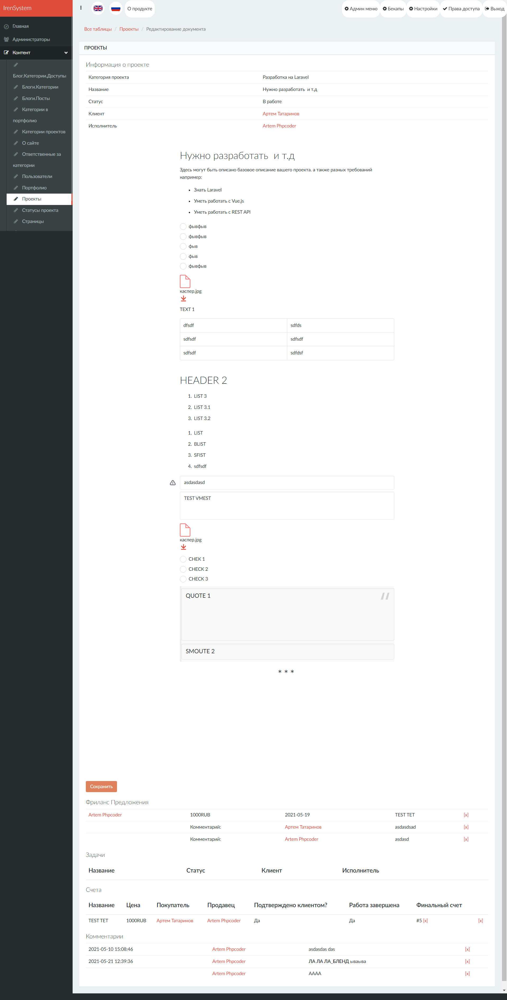

Редактирование записи в блоге из админки

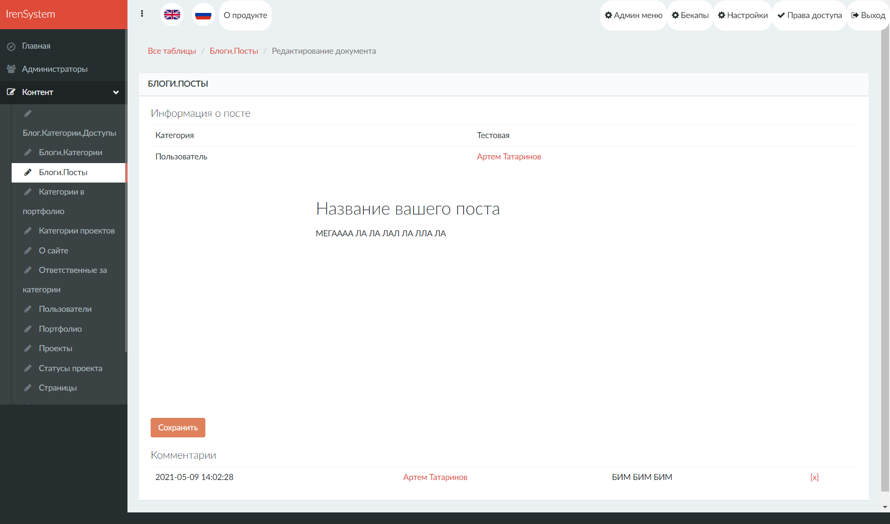

Все мануалы по настройке есть в соответствующих папках
1. Настройка Бекенда /back/readme.txt
2. Настройка Фронта /front/readme.txt
3. Настройка приложения для винды или linux /desktop/readme.txt

Для обновления , забекапьте следующие папки\файлы

back/.env

back/files

back/engine/db_json

back/.env

а после выполните 
cd engine & php artisan migrate 

